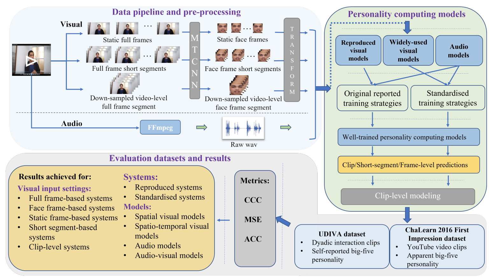

# An Open-source Benchmark of Deep Learning Models for Audio-visual Apparent and Self-reported Personality Recognition
## Introduction
This is the official code repo of *An Open-source Benchmark of Deep Learning Models for Audio-visual Apparent and Self-reported Personality Recognition* (https://arxiv.org/abs/2210.09138).

In this project, **seven visual models**, **six audio models** and **five audio-visual models** have been reproduced 
and evaluated. Besides, **seven widely-used visual deep learning models**, which have not been applied to video-based 
personality computing before, have also been employed for benchmark. Detailed description can be found in our paper.

All benchmarked models are evaluated on: 
the [ChaLearn First Impression dataset](https://chalearnlap.cvc.uab.cat/dataset/24/description/#) and
the [ChaLearn UDIVA self-reported personality dataset](https://chalearnlap.cvc.uab.es/dataset/41/description/#)


<center>

</center>

This project is currently under active development. Documentation, examples, and tutorial will be progressively detailed


## Installation
 **Setup project**: you can use either Conda or Virtualenv/pipenv to create a virtual environment to run this program.

```shell
# create and activate a virtual environment
virtualenv -p python38 venv
source venv/bin/activate
````

#### Installing from PyPI

```shell
pip install deep_personality
``` 

#### Installing from Github
```shell
# clone current repo
git clone DeepPersonality
cd DeepPersonality

# install required packages and dependencies
pip install -r requirements.txt
```


## Datasets 

The datasets we used for benchmark are [Chalearn First Impression](https://chalearnlap.cvc.uab.cat/dataset/24/description/#) 
and [UDIVA](https://chalearnlap.cvc.uab.es/dataset/41/description/#). 

- The former contains  10, 000 video clips that come from 2, 764 YouTube users for apparent personality recognition(impression), 
where each video lasts for about 15 seconds with 30 fps. 

- The latter, for self-reported personality, records 188 dyadic 
interaction video clips between 147 voluntary participants, with total 90.5h of recordings. Every clip contains two audiovisual files, where each records a single participant’s behaviours. 

- Each video in both datasets is labelled with the Big-Five personality traits. 


To meet various requirements from different models and experiments, we extract raw audio file and all frames from a video
and then extract face images from each full frame, termed as face frames. 

For quick start and demonstration, we provide a
**[tiny Chalearn 2016 dataset](https://drive.google.com/file/d/1S87nJFLz9ygzw2Ep_rJUXzzWFfdz15an/view?usp=sharing)** 
containing 100 videos within which 60 for training, 20 for validation and 20 for test. Please find the process methods in 
**[dataset preparation](datasets/README.md).**


## Experiments
### Reproducing reported experiments
We employ a build-from-config manner to conduct an experiment. After setting up the environments and preparing the data needed,
we can have a quick start by the following command line:
```shell
# cd DeepPersonality # top directory 
script/run_exp.py --config path/to/exp_config.yaml 
```
For quick start with [tiny ChaLearn 2016 dataset](https://drive.google.com/file/d/1S87nJFLz9ygzw2Ep_rJUXzzWFfdz15an/view?usp=sharing),
if you prepare the data by the instructions in above section, the following command will launch an experiment for `bimodal-resnet18 model`.
```shell
# cd DeepPersonality # top directory
script/run_exp.py --config config/demo/bimodal_resnet18.yaml
```
Detailed arguments description are presented in  **[command line interface file](docs/Command_line_interface.md)**.


For quick start demonstration, please find the Notebook:
**[QuickStart](https://colab.research.google.com/drive/1QgISDUbLN0UFFK78e5Zmwcyfn8xtpr3o?usp=sharing)**


For experiments start from raw video processing, please find this Notebook:
**[StartFromDataProcessing](https://colab.research.google.com/drive/1_YThB_O1nO4y9zK6AHOUEx-a2zb_ba9y?usp=sharing)**


### Developing new personality computing models
We use config-pipe line files and registration mechanism to organize our experiments. If user want to add their own 
models or algorithms into this program please reference the 
**[TrainYourModel](https://colab.research.google.com/drive/1lB3B0C9LgZ6NmZmsdblRKcfiY6nWoEcI?usp=sharing)**


# Models

| Model                                                                       |    Modal    |                                                           ChaLearn2016 cfgs                                                            | ChaLearn2016 weights | ChaLearn2021 cfgs | ChaLearn2021 weights |
|-----------------------------------------------------------------------------|:-----------:|:--------------------------------------------------------------------------------------------------------------------------------------:|:--------------------:|:-----------------:|:--------------------:|
| [DAN](dpcv/modeling/networks/dan.py)                                        |   visual    |                                   [cfg](config/unified_frame_images/01_deep_bimodal_regression.yaml)                                   |                      |                   |                      |
| [CAM-DAN<sup>+](dpcv/modeling/networks/interpret_dan.py)                    |   visual    |                                        [cfg](config/unified_frame_images/06_interpret_cnn.yaml)                                        |                      |                   |                      |
| [ResNet](dpcv/modeling/module/resnet_tv.py)                                 |   visual    |                                   [cfg](config/unified_frame_images/03_bimodal_resnet18_visual.yaml)                                   |                      |                   |                      |
| [HRNet](dpcv/modeling/networks/hr_net_cls.py)                               |   visual    |            [cfg-frame](config/unified_frame_images/09_hrnet.yaml)/[cfg-face](config/unified_face_images/02_hrnet_face.yaml)            |                      |                   |                      |
| [SENet](dpcv/modeling/networks/se_net.py)                                   |   visual    |            [cfg-frame](config/unified_frame_images/08_senet.yaml)/[cfg-face](config/unified_face_images/01_senet_face.yaml)            |                      |                   |                      |
| [3D-ResNet](dpcv/modeling/networks/resnet_3d.py)                            |   visual    |      [cfg-frame](config/unified_frame_images/11_resnet50_3d.yaml)/[cfg-face](config/unified_face_images/04_resnet50_3d_face.yaml)      |                      |                   |                      |
| [Slow-Fast](dpcv/modeling/networks/slow_fast.py)                            |   visual    |        [cfg-frame](config/unified_frame_images/12_slow_fast.yaml)/[cfg-face](config/unified_face_images/05_slow_fast_face.yaml)        |                      |                   |                      |
| [TPN](dpcv/modeling/networks/TSN2D.py)                                      |   visual    |              [cfg-frame](config/unified_frame_images/13_tpn.yaml)/[cfg-face](config/unified_face_images/06_tpn_face.yaml)              |                      |                   |                      |
| [Swin-Transformer](dpcv/modeling/networks/swin_transformer.py)              |   visual    | [cfg-frame](config/unified_frame_images/10_swin_transformer.yaml)/[cfg-face](config/unified_face_images/03_swin_transformer_face.yaml) |                      |                   |                      |
| [VAT](dpcv/modeling/networks/video_action_transformer.py)                   |   visual    |              [cfg-frame](config/unified_frame_images/14_vat.yaml)/[cfg-face](config/unified_face_images/07_vat_face.yaml)              |                      |                   |                      |
| [Interpret Audio CNN](dpcv/modeling/networks/audio_interpretability_net.py) |    audio    |                                       [cfg](config/unified_frame_images/07_interpret_audio.yaml)                                       |                      |                   |                      |
| [Bi-modal CNN-LSTM](dpcv/modeling/networks/bi_modal_lstm.py)                | audiovisual |                                        [cfg](config/unified_frame_images/02_bimodal_lstm.yaml)                                         |                      |                   |                      |
| [Bi-modal ResNet](dpcv/modeling/networks/audio_visual_residual.py)          | audiovisual |                                      [cfg](config/unified_frame_images/03_bimodal_resnet18.yaml)                                       |                      |                   |                      |
| [PersEmoN](dpcv/modeling/networks/sphereface_net.py)                        | audiovisual |                                          [cfg](config/unified_frame_images/05_persemon.yaml)                                           |                      |                   |                      |
| [CRNet](dpcv/modeling/networks/cr_net.py)                                   | audiovisual |                                            [cfg](config/unified_frame_images/04_crnet.yaml)                                            |                      |                   |                      |
| [Amb-Fac](dpcv/modeling/networks/multi_modal_pred_net.py)                   | audiovisual | [cfg-frame](config/unified_frame_images/15_multi_modal_pred.yaml), [cfg-face](config/unified_face_images/8_multi_modal_pred_face.yaml) |                      |                   |                      |


## Papers 
From which the models are reproduced

- Deep bimodal regression of apparent personality traits from short video sequences
- Bi-modal first impressions recognition using temporally ordered deep audio and stochastic visual features
- Deep impression: Audiovisual deep residual networks for multimodal apparent personality trait recognition
- Cr-net: A deep classification-regression network for multimodal apparent personality analysis
- Interpreting cnn models for apparent personality trait regression
- On the use of interpretable cnn for personality trait recognition from audio
- Persemon: a deep network for joint analysis of apparent personality, emotion and their relationship
- A multi-modal personality prediction system
- Squeeze-and-excitation networks
- Deep high-resolution representation learning for visual recognition
- Swin transformer: Hierarchical vision transformer using shifted windows
- Can spatiotemporal 3d cnns retrace the history of 2d cnns and imagenet
- Slowfast networks for video recognition
- Temporal pyramid network for action recognition
- Video action transformer network


## Citation

If you use our code for a publication, please kindly cite it as:
```
@article{liao2022open,
  title={An Open-source Benchmark of Deep Learning Models for Audio-visual Apparent and Self-reported Personality Recognition},
  author={Liao, Rongfan and Song, Siyang and Gunes, Hatice},
  journal={arXiv preprint arXiv:2210.09138},
  year={2022}
}
```

## History
- 2022/10/17 - Paper submission and make project publicly available.

## To Be Updated

[//]: # (- [ ] Detailed Data prepare pipeline description)
- [ ] Test Pip install
- [ ] Description of adding new models
- [ ] Model zoo
- [ ] Notebook tutorials
